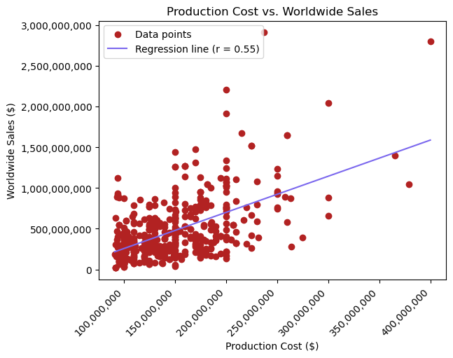
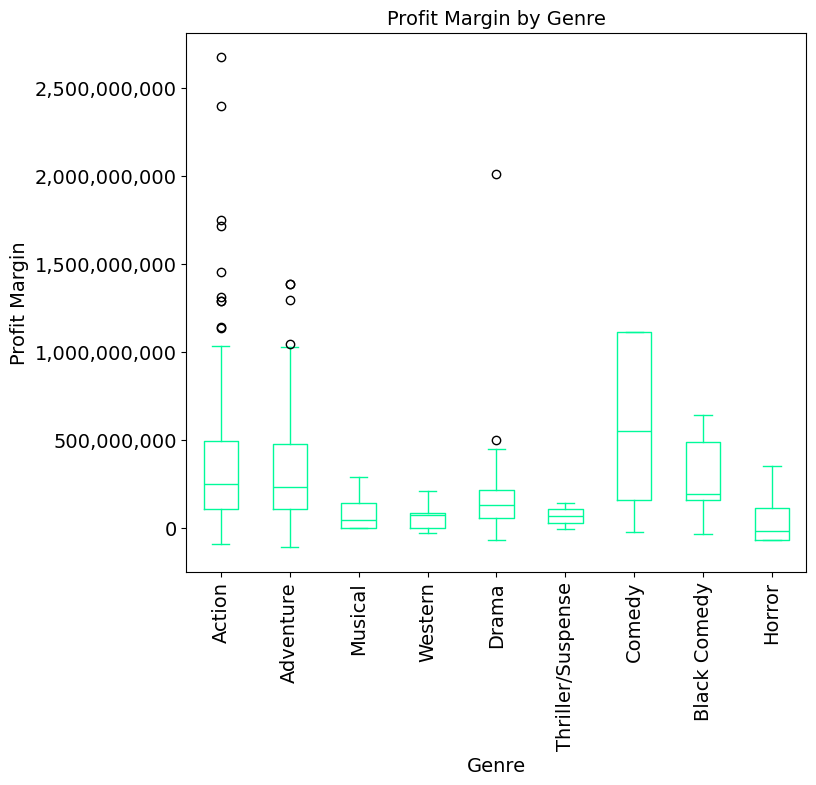
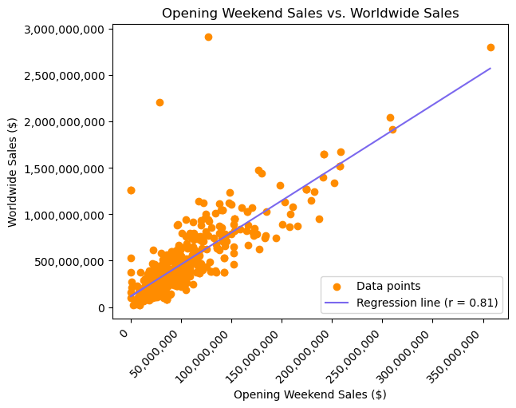
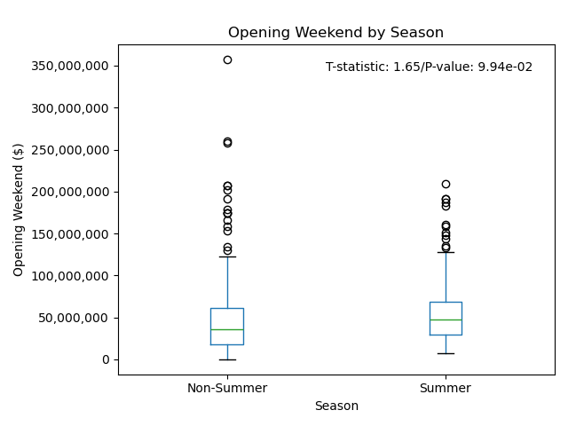
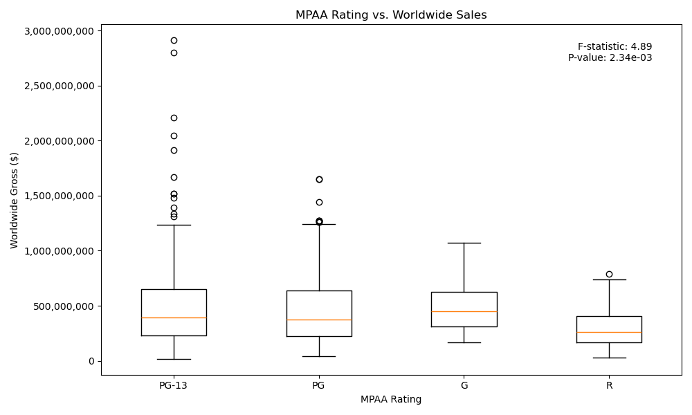
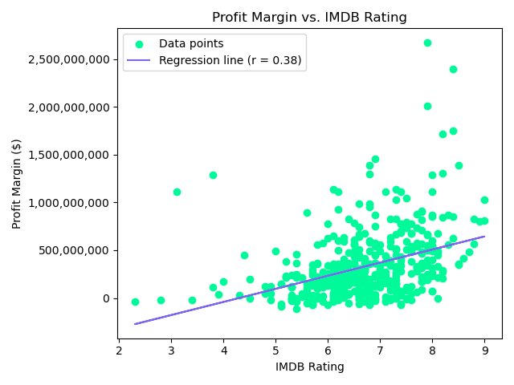

# Project 1: Movie Success Analysis

### Team Members
- Finn
- Jackson
- John
- Parisha
- Sanem

### Project Description/Outline
We are aiming to answer questions pertaining to what some may call a "dying industry." What factors go into making the theatrical release of a movie successful? Is a movie successful based on how much money was put into its production? Are certain genres more economical? Do movies with MPAA ratings that cater to a wider audience make more money in theaters? These are just some of the questions we're hoping to answer.

### Research Questions to Answer
1. Production Cost vs. Worldwide Sales
   - Graph Type: Scatter Plot
   - Stats Test: Linear regression
2. Opening Weekend Sales vs. Worldwide Sales
   - Graph Type: Scatter Plot
   - Stats Test: Linear Regression
3. Profit Margin vs. IMDB Viewer Rating
   - Profit Margin = Worldwide Sales - Production Cost
   - Graph Type: Scatter Plot
   - Stats Test: Linear Regression
4. Profit Margin vs. Genre
   - Graph Type: Box Plot or Bar Plot
   - Stats Type: ANOVA
5. Release Date vs. Opening Weekend Sales
   - Graph Type: Box Plot or Bar Plot
   - Stats Type: Independent T-test
6. Duration vs. Worldwide Sales
   - Graph Type: Scatter Plot
   - Stats Type: Linear regression
7. Duration vs. IMDB Viewer Rating
   - Graph Type: Scatter Plot
   - Stats Type: Linear Regression
8. MPAA Rating vs. Worldwide Sales
   - Graph Type: Box Plot or Bar Plot
   - Stats Type: ANOVA
9. Actor vs. Worldwide Sales
   - Graph Type: Bar Plot

### Datasets to Be Used
#### ["Top 500 Movies by Production Budget"](https://www.kaggle.com/datasets/mitchellharrison/top-500-movies-budget)
This dataset will include data surrounding:
- Production Cost
- Worldwide Sales
- Opening Weekend Sales
- Profit Margin (Worldwide Sales - Production Cost)
- Genre
- MPAA Rating

#### ["IMDB Movies Dataset"](https://www.kaggle.com/datasets/amanbarthwal/imdb-movies-data)
This dataset will include data surrounding:
- Release Date
- Duration
- Rating
- Cast (Actor information)

### Rough Breakdown on Tasks
- **Data cleaning:** Jackson
- **Data merging:** Finn
- **Data visualization:**
  - Finn: Profit Margin vs. IMDB Viewer Rating, Release Date vs. Opening Weekend Sales
  - Jackson: Opening Weekend Sales vs. Worldwide Sales, Production Cost vs. Worldwide Sales
  - John: Duration vs. IMDB Viewer Rating, Duration vs. Worldwide Sales
  - Parisha: Profit Margin vs. Genre
  - Sanem: Actor vs. Worldwide Sales, MPAA Rating vs. Worldwide Sales
- **Data Analysis/Summary:** Parisha, Finn
- **Presentation:** Jackson, Parisa, Finn

### Our Hypotheses
- High production cost results in higher worldwide sales
- There is a significant difference between movie genres when it comes to profitability 
- There's a strong correlation between opening weekend sales and worldwide sales
- Summer movies have higher opening weekend sales
- MPAA Rating significantly impacts worldwide sales 

### Our Null Hypotheses
- Higher production costs do not result in higher or lower worldwide sales
- There is no significant difference in profitability between movie genres
- There is no correlation between opening weekend sales and worldwide sales
- Summer movies do not have higher opening weekend sales compared to non-summer movies
- There is no difference in worldwide sales when it comes to a movie’s MPAA Ratinge.

### Process

We chose to do our project on the movie industry because we were all interested in studying it. Our group leveraged the class activities we’ve learned so far to complete the process—from importing the csv files to cleaning the data to completing the analysis and visualizations. We imported the following libraries for completing the code: matplotlib, scipy, scipy.stats, sklearn, pandas, and numpy.

We leveraged Python code to merge two raw datasets (“imdb-movies-dataset.csv” and “top-500-movies.csv”) that we had converted dataframes. We merged them on “Title,” seeing as that was the common factor between them.  We then narrowed them down to the columns we wanted to use and renamed them. Lastly, we dropped any null values. This narrowed our final dataset (“movie_clean_df”) to 460 rows/datapoints. 

We leveraged Python to create scatter plots, box plots, and a bar graph to complete the analysis. To go along with these graphs, we continued to leverage Python to find the linear regression (r-values and p-values) for the scatter plots. For the two category boxplot (Opening Weekend by season), we found the t-statistic and p-value using independent t-testing. For multiple category box plots (MPAA Rating and Genre), we found the f-statistics and p-values using ANOVA testing.

### Analysis

#### Production Cost vs. Worldwide Sales
Our first hypothesis is that higher production costs would increase worldwide sales. We argue that the more money a production company puts into a movie, the higher the return they will see (thinking of action movies like The Avengers or Barbie). The null hypothesis in this instance would be that higher production costs do not result In higher or lower worldwide sales.

An r-value of 0.55 between production cost and worldwide sales indicates a moderate positive correlation. This suggests that worldwide sales also tend to increase as production costs increase, but the relationship is not extremely strong. 

The p-value in this instance is 3.29e-38. With a p-value significantly less than .05, we can safely reject the null hypothesis. Movie execs can expect to see higher worldwide sales if they put more money into production, which can include things such as higher quality productions, better special effects, more prominent actors, and more extensive marketing campaigns. This can bring in larger audiences and result in higher worldwide sales.

#### Profit Margin vs. Genre
Our second hypothesis is that genre has an impact on a movie’s profitability. We define profit margin as (Worldwide Sales – Production Cost). The null hypothesis in this instance would be that there is no significant difference between a movie’s genre and its profitability.

In this instance, our p-value of .005 allows us to reject the null hypothesis, telling us that genre does impact profit margin.

The f-statistic measures the ratio of the variance explained by the model to the unexplained variance. We referenced an F distribution critical values chart to find that our critical value for the F-statistic is 1.938 (we had 9 groups and 460 observations). An F-statistic value of 2.75 in this instance suggests that the genre of a movie explains a meaningful portion of the variance in worldwide sales. This furthers our ability to reject the null hypothesis.
Our statistical analysis allows us to say that there is a significant difference in profitability when it comes to movie genre. When looking at the boxplot, it can be seen that Comedy, Action, Adventure, and  Black Comedy are the most profitable. Action also has a good amount of outliers. Based on these findings, movie execs should capitalize on making fims in these genres if they want to see the most profitability.

#### Opening Weekend Sales vs. Worldwide Sales
Our third hypothesis is that there is a correlation between a movie’s opening weekend sales and its overall worldwide sales. In other words, movies that do well on opening weekend are more likely to do well overall. Our null hypothesis in this instance would be that there is no correlation between a movie’s opening weekend sales and its overall worldwide sales.

An r-value of 0.81 between opening weekend and worldwide sales indicates a strong positive correlation. This suggests that movies with higher opening weekend sales tend to have higher worldwide sales.

In this instance, our p-value is 1.17e-107. With a p-value significantly less than .05, we can safely reject the null hypothesis.

When looking at this data, movie execs may want to capitalize on marketing, distribution, and press tours to ensure their opening weekends are as profitable as possible.

#### Release Date vs. Opening Weekend Sales
Our fourth hypothesis is that the release date significantly determines a movie’s opening weekend sales. In particular, summer movies have higher opening weekend sales. This hypothesis is based on our understanding that going to the movies is more prevalent during the summer. Our null hypothesis is that summer movies do not have higher opening weekend sales compared to non-summer movies.

The p-value of 0.0994 is greater than our benchmark of 0.05. This means the difference in opening weekend sales between summer and non-summer movies is not statistically significant. Thus, we fail to reject the null hypothesis.

Although not statistically significant, we also conducted an independent t-test. The t-statistic value of 1.65 barely beat our t-critical value of 1.646. The t-statistic of 1.65 and a p-value of 0.0994 indicate a trend that summer movies might have higher opening weekend sales compared to non-summer movies. This trend is approaching significance and may warrant further investigation with a larger sample size or additional data. 

The p-value suggests that other factors besides the release season may be influencing opening weekend sales. These factors could include marketing efforts, competition from other movies, the popularity of the franchise, and star power.

### MPAA Rating vs. Worldwide Sales
Our fifth and last hypothesis is that MPAA Rating significantly impacts worldwide sales. G, PG, and PG-13-rated movies have higher worldwide sales compared to R-rated movies because they appeal to a wider audience (i.e., their audience includes children). Our null hypothesis is that there is no difference in worldwide sales when it comes to a movie’s MPAA Rating.

The p-value of 0.00234 is well below our threshold of 0.05. This indicates a statistically significant difference in worldwide sales across different MPAA ratings. The low p-value suggests that the variation in worldwide sales is unlikely due to random chance, and the MPAA rating likely has a tangible impact on the sales. Therefore, we can reject the null hypothesis.

We also conducted an ANOVA test. Again, the f-statistic measures the ratio of the variance explained by the model to the unexplained variance. We referenced an F distribution critical values chart to find that our critical value for the F-statistic is 2.605 (we had 4 groups and 460 observations). An F-statistic value of 4.89 suggests that the MPAA rating explains a meaningful portion of the variance in worldwide sales. 
The statistically significant f-statistic and p-value indicate that MPAA ratings directly impact worldwide sales. Studios can leverage this insight for strategic decision-making in movie production, marketing, and distribution to maximize their financial returns. 

### Additional Analysis

#### Top 10 Actors by Total Worldwide Gross

This information is useful in that it tells us (and those behind making movies) what actors play a significant role in the success of a movie. The idea is that by highlighting the actors that make their respective movies the most money, that information can be leveraged when deciding who to caste in the movie. 
The top 3 thru 10 actors are relatively close in the total worldwide gross values they bring in. However, when we get to the top 2 actors, we see total worldwide gross skyrocket. The total worldwide gross value jumps 20.34% from Ian McKellen to Joe Russo. Moreover, the total worldwide gross value jumps 36.89% from Joe Russo and Robert Downey Jr. It looks like those Avengers and Iron Man movies made movie executives a pretty penny.

#### Duration

Both duration graphs have statistically significant p-values (Duration vs. Worldwide Sales p-value is 6.8e-06 and Duration vs. IMDB Viewer Rating p-value is 3.17e-10), which tell us that the duration of a film does have a positive correlation with its financial success and popularity.
We could use this information to conduct additional analysis for many of the questions that we have above. As duration is positively related to worldwide sales, it is also positively related to opening weekend sales as opening weekend sales has already been proven to be related to worldwide sales. We can also use this to explain further the relationship between a movie’s MPAA rating and worldwide sales, as well as its IMDB rating.

#### Profit Margin vs. IMDB Rating

In the graph above, IMDB ratings are a moderately strong indicator (r=.38) of a movie's profit margin. A p-value of 4.82e-17 proves that this relationship is statistically significant. This suggests that higher IMDB ratings are associated with higher profit margins. This tells movie executives that it’s important to leverage streaming platforms and press reviews to ensure their movie is talked about favorably and seen by as many people as possible to maintain popularity and subsequently profits. When someone sees a movie on one of the streaming platforms or in theatres after hearing a movie reporter talk about it positively, they are more likely to express their positive opinion on it and rate it favorably on IMDB after seeing it. However, while the correlation is significant, it's important to recognize that other factors also contribute to a movie's financial success.

### Conclusion & Implications

#### Opening Weekend and Genre

The strong correlation (r = .81) between a movie’s opening weekend and its total worldwide sales demonstrated the importance of a profitable opening weekend. At the same time, genres like Comedy, Action, Adventure, and Dark Comedy are associated with higher profits. Movie execs should therefore leverage this information to focus on producing movies in these genres and ensure they market them in a way that secures successful opening weekends.

#### Production Costs and Profitability Across Genres

While higher production costs generally lead to higher worldwide sales, the degree of this correlation could change across genres. Action and Adventure genres, known for their big production budgets, show significant returns on investment. However, the moderate positive correlation (r = 0.55) suggests that production costs are not the determining factor in guaranteeing a movie’s success. Genre-specific audience appeal and marketing strategies also play critical roles. For instance, they could leverage the data surrounding popular actors and strategically give certain actors in certain genres certain roles to boost profits. This insight prompts movie execs to balance investment in production with genre-specific market research to ensure profitability.

#### MPAA Rating and Audience Engagement

The significant influence of MPAA Rating on worldwide sales (p = 0.00234) displays audience preferences and viewing demographics. G, PG, and even PG-13-rated movies attract wider audiences, including families and younger viewers, translating into higher ticket sales globally. This finding stresses the importance of matching content with audience expectations to maximize revenue and reach. Studios can leverage MPAA ratings as a strategic tool in content development and marketing, ensuring alignment with audience preferences to enhance commercial success.

### Limitations

- Our final movie_clean.csv dataset contained 460 data points. Working with a larger dataset would give us more insight into a wider variety of movies.
- Our initial datasets limited our scope of what movies we considered in our analysis as well. Starting with the top 500 movies by production budget only gave us insight into the big-time movies. What about the market behavior pertaining to smaller indie films? Also, looking at IMDB’s dataset limited us to one type of rating. What about other types of ratings like Rotten Tomatoes? 
- The datasets did not offer breakdowns of worldwide sales and production cost. Better understanding the sources of revenue and where the production budget dollars were going could have deepened our analysis. 

### Additional Analysis if we had more time

- It would be beneficial to better understand the benchmarks surrounding what makes a movie more successful. This could help us better understand the current state of affairs in the movie industry as it pertains to profits. Are movies currently bringing in as much money as they used to? 
- While worldwide sales are a great indicator of a movie’s financial success, movie executives and the people who profit from the movie are more concerned with profit margin. Most of our analysis focuses on worldwide sales, but if we were interested in optimizing a movie’s return on investment, we could add more to our analysis by including more graphs that use profit margin as the independent variable instead of worldwide sales. 
- We would be interested in examining performance broken down by location. It would be useful to better understanding market dynamics by continent or country. The success of a movie in one country may not always translate to success in other countries.
- Given we live in a streaming-centered world, it would benefit us to understand a movie’s performance on streaming services. We could answer the question of which movies or genres get the highest number of streams and ratings on services like Netflix, Hulu, Max, etc. This would help us better understand the movie industry’s economic and societal footprint.

### Additional info:

- Our presentation slides can be viewed in the ‘Movie Success Analysis.pptx’ found in the ‘Presentation’ folder
- The various graphs and charts created from analysis can be viewed in the ‘movie_analysis_visualizations’ folder of this repository.
- The csv datasets can be viewed in the ‘Resource’ folder of this repository.
- The final Python code can be viewed in the ‘movie_FINAL’ and ’Cleaned_Data” notebooks in this repository.

### Sources
- [NumPy Standard Deviation](https://numpy.org/doc/stable/reference/generated/numpy.std.html)
- [SciPy Tutorial](https://docs.scipy.org/doc/scipy/tutorial/index.html)
- [Pandas DataFrame Reference](https://pandas.pydata.org/docs/reference/frame.html)
- [Matplotlib Pyplot Plot](https://matplotlib.org/stable/api/_as_gen/matplotlib.pyplot.plot.html)
- [IMDB Movies Dataset](https://www.kaggle.com/datasets/amanbarthwal/imdb-movies-data)
- [Top 500 Movies by Production Budget](https://www.kaggle.com/datasets/mitchellharrison/top-500-movies-budget?resource=download)
- [F-Critical Value](https://www.stat.purdue.edu/~lfindsen/stat503/F_alpha_05.pdf)
- [T-Critical Value](https://www.me.psu.edu/casestudy/Statistics/Ttable.htm)
